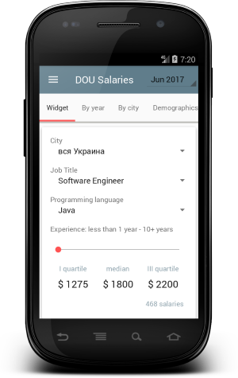
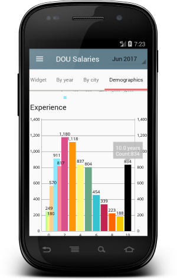
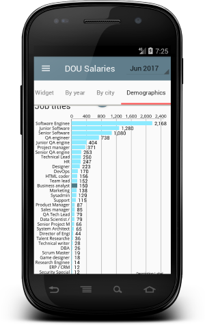
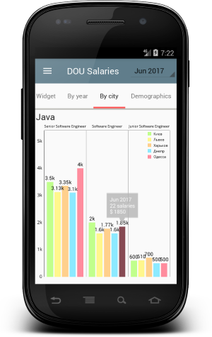
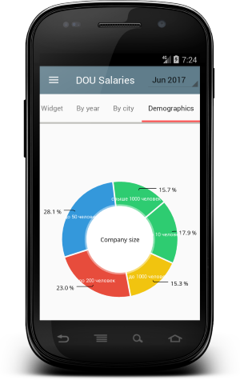
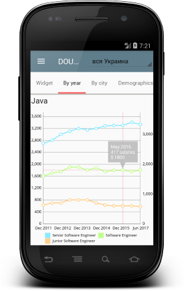

# DOU Salaries for Android 

<p align="center">
  
</p>

Developers salaries in Ukraine. The data is based on anonymous survey by DOU.UA of full-time employees at top IT companies in Ukraine.
 All wages are net (after taxes), monthly, USD. Office, admin and other expenses not included. 
 
 Salary surveys CSV data: github.com/devua/csv/tree/master/salaries. 

## Project Structure
### Data 
It contains all the data(Shared Preferences, Local DB and Remote API) accessing and manipulating components
### Injection
Dependency providing classes using Dagger2
### Events
EventBus events classes that simplifies communication between Activitie and Fragments
### UI
View classes along with their corresponding Presenters
### Utils
Utility classes

## Preview

Widget|Demographics|Demographics 
-------------|-----------------|-----------------
  |  |  


By city|Demographics|By year
-------------|-----------------|-----------------
 |  |   


## Contributing

Contributions are welcome to the project! 
Read [contributing](https://github.com/graviton57/DouSalaries/blob/master/CONTRIBUTING.md)  make pull request and you are IN!

### Reporting Bugs & Bug Fixes

If you find a bug you can report it by using the [issues section](https://github.com/graviton57/DouSalaries/issues) for this project. Bug fixes should also be done in pull requests.

### Features & Feature Requests

If there is some feature you want to implement, I invite you to do a pull request.

Feature request should be reported in the [issues section](https://github.com/graviton57/DouSalaries/issues) for this project.


## Library reference resources
- [Support library](https://developer.android.com/topic/libraries/support-library/index.html)
- [RxJava2](https://github.com/ReactiveX/RxJava), [RxAndroid](https://github.com/ReactiveX/RxAndroid) and [RxBindings](https://github.com/JakeWharton/RxBinding)
- [Dagger2](https://google.github.io/dagger/)
- [Retrofit2](http://square.github.io/retrofit/)
- [Okhttp3](https://github.com/square/okhttp/)
- [Butterknife](https://github.com/JakeWharton/butterknife)
- [Greenrobot EventBus](http://greenrobot.org/eventbus/)
- [Timber](https://github.com/JakeWharton/timber)
- [Fresco - A powerful image downloading and caching library for Android](https://github.com/facebook/fresco/)


# License
```                                  
   Copyright 2017 Igor Gavrilyuk

   Licensed under the Apache License, Version 2.0 (the "License");
   you may not use this file except in compliance with the License.
   You may obtain a copy of the License at

       http://www.apache.org/licenses/LICENSE-2.0

   Unless required by applicable law or agreed to in writing, software
   distributed under the License is distributed on an "AS IS" BASIS,
   WITHOUT WARRANTIES OR CONDITIONS OF ANY KIND, either express or implied.
   See the License for the specific language governing permissions and
   limitations under the License.
```
